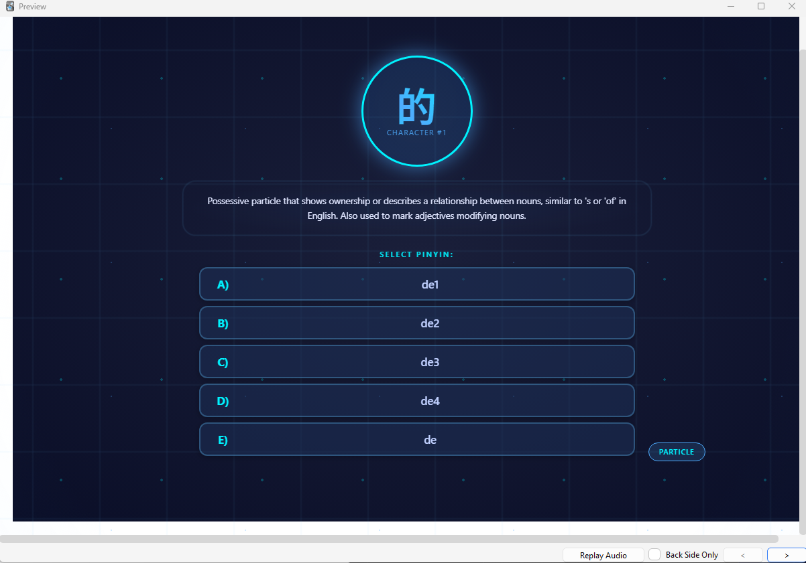
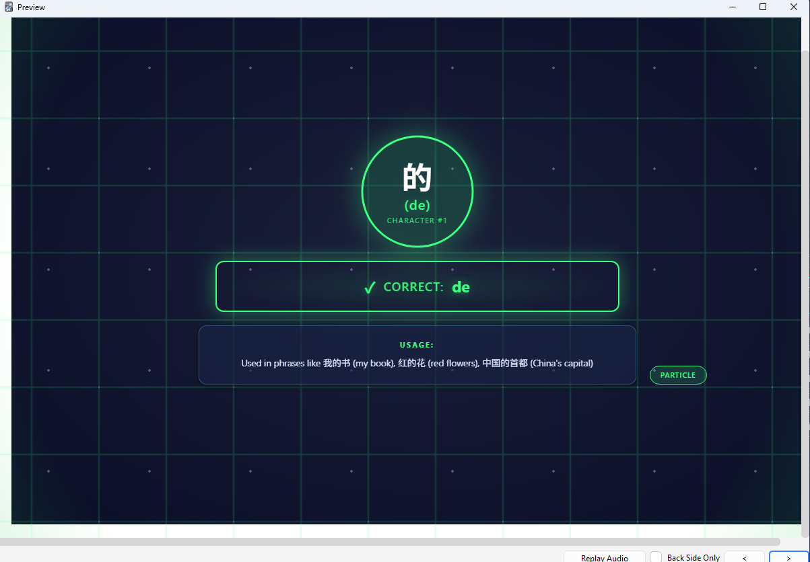

> # ⚠️ DEPRECATED
>
> **This repository is archived as v1.** The current active project is **[Language-Learning-V2](https://github.com/RexRenatus/Language-Learning-V2)** — multilingual vocabulary decks with MCQ recognition/recall cards, Gemini-curated example sentences, BGE-M3 semantic distractors, and UniDic-clean Japanese dictionary forms.
>
> Downloads and documentation have moved. The history below is preserved for context.
>
> ---


# 🌍 Language Learning Journey

> *"The acquirement of knowledge is not only a positive escape but one that continuously changes your perspective on the world for the better."*

Welcome to my language learning laboratory—a living documentation of an experiment in learning at scale. This isn't just a repository of n-grams; it's a chronicle of discovering how the human brain acquires languages, and perhaps more importantly, how we can learn to learn anything.

---

## 🧭 The Journey So Far

### **The Philosophy**
Traditional language learning follows a predictable path: vocabulary → grammar → comprehension. But what if we could leverage the brain's natural pattern recognition abilities first?

**My Hypothesis**: Massive exposure to authentic content—reading and listening without forcing comprehension—primes the brain for intuitive understanding. Repetition builds pattern recognition. Pattern recognition builds comprehension. Comprehension builds fluency.

**The Experiment**: 100 hours of reading + 100 hours of listening per language, monthly. No forced memorization. Just exposure, observation, and documentation.

### **Current Status**

#### 🎯 Active Languages
1. **Mandarin** (Primary) - DLPT 1+ target in 6 months
   - Using Harry Potter Book 1 for contextual immersion
   - 21,070 n-grams processed (2-6 word combinations)
   - 1,927 unique characters extracted with pinyin
   - **Flashcard Infrastructure:**
     - Character → Pinyin (5-choice multiple choice: 4 tones + neutral)
     - Pinyin → Character (5-choice with prime-based randomization)
     - 3,854 total flashcard variations ready for Anki
   - **Character Definitions:**
     - Complete English definitions for all 1,927 characters via OpenRouter API
     - Claude Sonnet 4.5 model with XML-formatted prompts
     - 100% success rate with parallel processing (26 minutes total)
     - Includes definition, usage context, and part of speech
   - **Pronunciation Practice:**
     - 56,023 minimal pairs (tone contrast pairs)
     - 519 consolidated tongue twisters for voice recording
     - 12 retroflex-palatal-dental phonetic progressions
   - **Word Frequency Analysis:**
     - 3,986 unique words extracted from 21,070 n-grams
     - Top 996 words (25%) = 93% frequency coverage (Pareto validated)
     - Single-char: 792 words (20%) → 70% frequency
     - Multi-char: 3,194 words (80%) → 30% frequency
     - Learning progression: Characters → Words → Phrases
   - **Anki Templates - Neural Network Theme:**
     - Character → Pinyin templates (Front/Back with neural animations)
     - Pinyin → Character templates (Front/Back with success states)
     - Mobile optimized (safe areas, 48-50px touch targets)
     - Inline CSS, self-contained, direct CSV import ready
     - Location: `.claude/anki-templates/`
   - Total frequency captured: 333,233 occurrences

## 🎨 Anki Template Preview

Neural network themed flashcards with animated neurons, synaptic connections, and portal effects optimized for mobile study:

### Pinyin → Character Flashcards

**Front Card**: Shows pinyin in central neuron with definition and 5 character choices (A-E)



**Back Card**: Shows pinyin → character transformation with success state, correct choice indicator, and usage examples



*Character → Pinyin templates follow the same immersive neural network theme with animated neurons and success states*

---

2. **Korean** (Testing Ground)
   - 1,070,403 n-grams processed (subtitle corpus)
   - Seoul accent IPA transliteration complete (formal + casual)
   - 109 chunks with dual IPA columns ready for flashcards
   - 파친코 (Pachinko) audiobook selected for immersion testing

3. **Spanish** (Planned)
   - Corpus collected, processing queued
   - Lower priority—following proven workflow from Korean/Mandarin

#### 📊 What's Been Built
- ✅ Repository restructured for language learning journey
- ✅ Automated n-gram extraction and processing pipeline
- ✅ Frequency-based chunking system (Mandarin: 1K segments, Korean: 10K chunks)
- ✅ Dual-stage learning workflow: Quizlet (exposure) → Anki (retention)
- ✅ Journal system documenting daily insights and patterns
- ✅ Weekly review system for pattern analysis and planning (Week Oct 6-12 complete)
- ✅ Seoul accent IPA transliteration (formal + casual connected speech rules)
- ✅ Korean processing: 1.07M+ n-grams with dual IPA columns
- ✅ Mandarin character extraction (1,927 characters from Harry Potter corpus)
- ✅ Dual flashcard formats: Character→Pinyin and Pinyin→Character
- ✅ Mathematical randomization for distractor selection (no patterns)
- ✅ OpenRouter API integration: English definitions for all 1,927 Mandarin characters
- ✅ Minimal pairs & tongue twisters: 56K pairs → 519 consolidated entries
- ✅ Parallel processing implementation (4.6x speed improvement)
- ✅ Word frequency analysis: 3,986 unique words from 21K n-grams
- ✅ Anki templates: Neural network theme for mobile devices
- 📋 Voice actor recording session (planned: 519 tongue twisters)
- 📋 GitHub automation agent (planned)

---

## 🗺️ Where We're Heading

### **Immediate Roadmap** (Oct 2025)
- [x] **Korean IPA Transliteration**: ✅ Complete - 1.07M+ n-grams with Seoul accent (formal + casual)
- [x] **Weekly Review System**: ✅ Established - Reviews completed (Sep 28 - Oct 5, Oct 6-12)
- [x] **Mandarin Character Definitions**: ✅ Complete - 1,927 characters with English definitions via OpenRouter API
- [x] **Minimal Pairs & Tongue Twisters**: ✅ Complete - 56K pairs consolidated to 519 entries
- [x] **Word Frequency Analysis**: ✅ Complete - 3,986 unique words extracted from n-grams
- [x] **Anki Templates**: ✅ Complete - Neural network theme templates for both flashcard types
- [ ] **Anki Deck Setup**: Import character flashcards with 90%+ recall threshold
- [ ] **Voice Actor Recording**: Record 519 tongue twisters (slow/normal/fast speeds)
- [ ] **파친코 Immersion**: Begin audiobook repetition experiment (reading + listening)
- [ ] **Automation**: GitHub agent MVP for commit/push workflows
- [ ] **Spanish Processing**: Complete corpus → n-gram pipeline

### **6-Month Goals** (→ Apr 2026)
- [ ] Mandarin DLPT 1+ proficiency (reading + listening)
- [ ] Complete Harry Potter series (Books 1-7) in target languages
- [ ] Validate exposure-based learning methodology with data
- [ ] Publish learning framework for others to replicate

### **The Vision**
This project extends beyond language acquisition. It's developing a **universal learning methodology**—a framework for absorbing complex knowledge at scale through pattern recognition rather than brute memorization.

The skills developed here apply to:
- Programming languages
- Musical patterns
- Mathematical notation
- Any domain with recognizable patterns

---

## 📂 Repository Structure

```
Language-Learning-Journey/
│
├── 📚 languages/                    # N-gram datasets per language
│   ├── korean/
│   │   ├── source/                  # Raw corpus data
│   │   ├── ngrams/
│   │   │   ├── chunks/              # Original chunks (109 files, 1.07M n-grams)
│   │   │   ├── chunks_with_ipa/     # IPA transliterated (formal + casual Seoul accent)
│   │   │   └── 파친코 analysis/     # Comparative analysis files
│   │   ├── reports/                 # Processing validation logs
│   │   └── KOREAN_PROCESSING_DOCUMENTATION.md  # Complete processing guide
│   │
│   ├── mandarin/
│   │   ├── ngrams/
│   │   │   ├── source/               # Original and processed n-grams
│   │   │   ├── chunks/               # 22 chunked files (1,000 n-grams each)
│   │   │   ├── characters/           # Character analysis & definitions
│   │   │   │   ├── by_character/     # Individual character CSV files (1,927)
│   │   │   │   ├── consolidated_characters.csv                    # All characters with pinyin
│   │   │   │   ├── consolidated_characters_with_definitions.csv   # + English definitions
│   │   │   │   ├── minimal_pairs_for_production.csv               # 56,023 tone pairs
│   │   │   │   └── consolidated_tongue_twisters.csv               # 519 pronunciation drills
│   │   │   └── flashcards/           # Multiple choice formats
│   │   ├── frequency_lists/          # Harry Potter word frequencies
│   │   └── reports/                  # Analysis and validation
│   │
│   └── spanish/                     # Queued for processing
│       └── [same structure]
│
├── 📓 Journal_Entries/              # The real story
│   ├── 2025/
│   │   ├── 09/                      # Daily insights, reflections
│   │   └── 10/                      # Pattern discoveries
│   └── Weekly_Reviews/              # Analysis, TODOs, actionable steps
│
├── 📋 Daily_Summaries/              # Comprehensive work logs
│   └── 2025-10-06_Summary.md        # Technical accomplishments, metrics, insights
│
├── 🔧 scripts/                      # Automation tooling
│   └── [Processing pipelines]       # N-gram extraction, cleaning, validation
│
└── 📖 README.md                     # ← You are here
```

---

## 🔬 The Methodology

### **Core Learning Loop**
1. **Exposure** → Audio/text immersion without comprehension pressure
2. **Pattern Recognition** → Brain naturally identifies recurring structures
3. **Vocabulary Anchoring** → N-grams provide "hooks" for meaning
4. **Intuitive Understanding** → Comprehension emerges from repeated patterns
5. **Explicit Learning** → Flashcards reinforce what intuition has prepared

### **Two-Stage Memory System**
- **Quizlet** (Stage 1): Rapid exposure, low-pressure repetition, initial pattern formation
- **Anki** (Stage 2): Spaced repetition for long-term retention after patterns established

### **Why N-grams?**
Single words lack context. Full sentences are overwhelming. N-grams (2-6 word chunks) hit the sweet spot:
- Capture common collocations and grammar patterns
- Provide natural usage context
- Frequency-sorted for maximum learning efficiency
- Digestible for pattern recognition

### **Why Harry Potter?**
- **Familiar narrative**: Known story reduces cognitive load
- **Rich vocabulary**: 3,000+ unique situations and contexts
- **Natural progression**: 7 books = 7 complexity levels
- **Audio available**: Synchronized reading + listening practice

---

## 📊 Data & Metrics

### **N-gram Statistics**
| Language | Total N-grams | Frequency Count | Status |
|----------|--------------|-----------------|--------|
| Mandarin | 21,070 | 333,233 | ✅ Processed + Flashcards |
| Korean | TBD | TBD | 🔄 In Progress |
| Spanish | TBD | TBD | 📋 Queued |

### **Learning Metrics Tracked**
- Reading speed (characters/minute)
- Listening comprehension (self-assessed 1-10)
- Pattern recognition discoveries (logged daily)
- Hours toward 100/month goal (reading + listening)
- Flashcard retention rates (Quizlet → Anki transition)

---

## 🧪 Current Experiments

### **Testing Now**
1. **Exposure-First Learning**: Can massive input create intuitive understanding before explicit study?
2. **Multi-Modal Reinforcement**: Does reading + listening + flashcards beat flashcards alone?
3. **Frequency Optimization**: Are high-frequency n-grams more effective than random vocabulary?

### **Recent Breakthroughs** (Oct 2025)

#### Korean IPA Transliteration System
- ✅ **Seoul Accent Implementation**: Complete phonological rule engine
  - Formal vs. casual speech differentiation
  - Connected speech rules: nasal assimilation, liquid assimilation, aspiration spreading
  - Intervocalic voicing (casual speech only)
  - Processed 1.07M+ n-grams across 109 chunks
- **Impact**: Pronunciation learning during flashcard phase significantly improved

#### 파친코 Corpus Analysis
- ✅ **Comparative Study**: 337 파친코 n-grams vs 1.07M corpus chunks
  - 69.4% overlap validates corpus quality
  - 30.6% "unique" entries ALL had irregular spacing (OCR artifacts)
- **Lesson**: Clean source text critical; subtitle corpus quality confirmed

#### Mandarin Character Analysis & Definitions (Oct 9-12, 2025)
- ✅ **Character Extraction**: 1,927 unique characters from Harry Potter n-grams
  - Individual character files with all containing n-grams
  - Consolidated CSV with pypinyin-generated pinyin
  - Frequency-sorted for prioritized learning

- ✅ **English Definitions via OpenRouter API**:
  - Claude Sonnet 4.5 model with XML-formatted prompts
  - Parallel processing: 100 concurrent requests (4.6x speed improvement)
  - Processing time: 26 minutes for all 1,927 characters
  - Success rate: 100% (1 JSON error fixed, all pinyin validated)
  - Output includes: definition, usage context, part of speech
  - Estimated cost: ~$4.50

- ✅ **Minimal Pairs & Tongue Twisters**:
  - Generated 56,023 minimal pairs (same pinyin, different tones)
  - Consolidated to 519 practical tongue twisters
  - Categories: tone series, aspiration contrasts, nasal finals, retroflex chains
  - Voice actor recording ready (slow/normal/fast speeds)

- ✅ **Triple Flashcard Formats - 50/50/50 Daily Stack**:
  - **Character → Pinyin**: 5-choice tone selection (1st-4th + neutral)
  - **Pinyin → Character**: 5-choice character recognition
  - **Definition → Character + Pinyin**: 5-choice semantic matching (NEW)
  - Mathematical randomization prevents pattern memorization
  - Answer distribution verified: 19-21% per position (balanced)
  - Each character seen 3× daily in different contexts (form, sound, meaning)

- **Impact**: Complete learning infrastructure ready
  - Definitions provide semantic understanding
  - Tongue twisters enable pronunciation practice
  - Triple-format flashcards reinforce Form × Sound × Meaning
  - Frequency prioritization ensures high-value study time
  - 50/50/50 stack = 150 cards/day → 6-week completion timeline

### **Previous Findings**
- ❌ **3000 characters/day memorization** (Mandarin attempt): Led to character confusion
  - **Root Cause**: Insufficient contextual exposure beyond Anki
  - **Lesson**: Repetition needs multiple modalities, not just spaced repetition

- ✅ **Chunked processing** (1,000 n-grams): Maintains motivation and enables progress tracking
- ✅ **Cost-optimized tooling** (Claude Code vs. Roocode): Sustainability matters for long projects

---

## 🛠️ How to Use This Repository

### **For Language Learners**
1. **Explore the n-grams**: Start with `languages/{language}/ngrams/clean/` for processed, frequency-sorted chunks
2. **Read the journey**: Check `Journal_Entries/Weekly_Reviews/` for methodology insights and lessons learned
3. **Adapt the workflow**: Use the processing scripts in `scripts/` for your own corpus

### **For Researchers**
1. **Review methodology**: Weekly reviews document hypothesis testing and results
2. **Access raw data**: Source corpora and processing logs available in language folders
3. **Track evolution**: Git history shows methodology refinements over time

### **For Developers**
1. **Study automation**: Scripts demonstrate n-gram extraction, validation, and chunking
2. **Contribute improvements**: PRs welcome for generalized tooling (see Roadmap)
3. **Build on framework**: Extend to new languages or learning domains

---

## 🎯 The Bigger Picture

### **What Success Looks Like**
- ✅ DLPT 1+ in Mandarin by April 2026
- ✅ Validated methodology with quantitative data
- ✅ Replicable framework for learning at scale
- ✅ Published insights for the learning community

### **Why Document Everything?**
1. **Accountability**: Public commitment drives consistency
2. **Refinement**: Writing clarifies thinking, reveals patterns
3. **Contribution**: Others can learn from both successes and failures
4. **Perspective**: Watching yourself learn is transformative

### **The Meta-Skill**
Language learning is the vehicle. The destination is **learning how to learn**—a universal skill that transforms how we approach any complex domain. Knowledge acquisition isn't escapism; it's continuous perspective transformation.

---

## 📚 Key Resources

### **In This Repository**
- [Weekly Reviews](Journal_Entries/2025/10/) - Analysis, patterns, actionable steps (Oct 6-12 latest)
- [Daily Journals](Journal_Entries/2025/) - Raw observations and reflections
- [Korean Processing Guide](languages/korean/KOREAN_PROCESSING_DOCUMENTATION.md) - Complete IPA system documentation
- [Korean N-grams with IPA](languages/korean/ngrams/chunks_with_ipa/) - 1.07M+ entries, dual transliterations
- [Mandarin Character Definitions](languages/mandarin/ngrams/characters/consolidated_characters_with_definitions.csv) - 1,927 characters with English definitions
- [Mandarin Tongue Twisters](languages/mandarin/ngrams/characters/consolidated_tongue_twisters.csv) - 519 pronunciation drills
- [Mandarin Flashcards](languages/mandarin/ngrams/flashcards/) - 5,781 flashcards across 3 formats (character↔pinyin, definition→character)
- [Anki Templates](.claude/anki-templates/) - Neural network themed flashcard templates with import instructions
- [N-gram Data](languages/) - Processed frequency lists ready for study

### **External Learning Stack**
- **Quizlet**: Early exposure and pattern formation
- **Anki**: Long-term retention and spaced repetition
- **Harry Potter**: Contextual immersion content
- **Claude Code**: Development and automation assistance

---

## 🤝 Contributing

This is a personal learning journey, but contributions are welcome:

### **How to Contribute**
1. **Share your experience**: Open an issue describing your own exposure-based learning results
2. **Improve tooling**: PRs for generalized scripts or better automation
3. **Add languages**: Follow the structure in `languages/` and submit processed n-grams
4. **Suggest experiments**: Ideas for validating or refining the methodology

### **Areas Needing Help**
- Generalized processing pipeline (multi-language support)
- CI/CD for data validation (GitHub Actions)
- Visualization dashboard for progress metrics
- Native speaker validation of n-gram accuracy

---

## 📝 Journal Entry Template

Want to track your own journey? Use this template:

```markdown
# TODO List
- [Task categories and current priorities]

# Journal Entries
- [Observations, insights, discoveries from today]

# Reflection
- [What worked, what didn't, why]

# Future TODO List
- [Tasks identified for later]
```

---

## 🔗 Quick Links

- **Repository**: [RexRenatus/Language-Learning-Journey](https://github.com/RexRenatus/Language-Learning-Journey)
- **Latest Review**: [Week Oct 6-12, 2025](Journal_Entries/2025/10/Weekly_Review_Oct_6-12.md)
- **Current Focus**: [October 2025 Journal](Journal_Entries/2025/10/)

---

## 💭 Final Thoughts

> *"People look for an escape from life, but that turn to hobbies that are regressive in nature. My belief is that the acquirement of knowledge is not only a positive escape but one that continuously changes your perspective on the world for the better."*

This repository is proof that learning doesn't have to follow conventional paths. Sometimes the best way forward is to trust the brain's natural abilities, provide massive input, and observe what emerges.

**The experiment continues. The data accumulates. The perspective transforms.**

Welcome to the journey. 🚀

---

*Last Updated: October 13, 2025*
*Languages in Progress: 3 | N-grams Processed: 1,091,473+ | Characters: 1,927 | Character Definitions: 1,927 | Flashcards: 5,781 (3 formats) | Tongue Twisters: 519 | Minimal Pairs: 56,023 | Korean IPA: ✅ | Weekly Reviews: Active*
